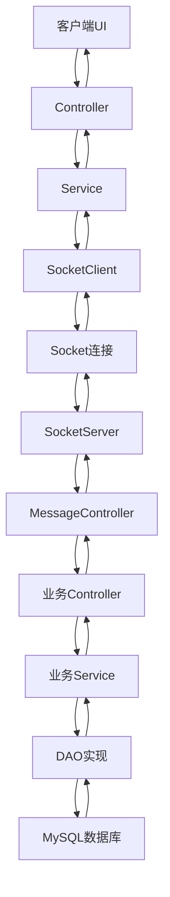

# VCampus 虚拟校园管理系统

<div align="center">


**一个功能完整的虚拟校园管理系统，基于Java 17 + JavaFX + MySQL技术栈**

[快速开始](#-快速开始) • [功能特性](#-功能特性) • [技术架构](#-技术架构) • [数据库设计](#-数据库设计) • [开发指南](#-开发指南) • [打包部署](#-打包部署) • [网络配置](#-网络配置如果是小组展示建议在一个热点内) • [常见问题](#-常见问题)

</div>

## 📖 项目简介

VCampus是一个基于Java开发的现代化虚拟校园管理系统，采用客户端-服务端架构，为校园提供全方位的数字化管理解决方案。系统支持学生、教师、管理员三种角色，涵盖学籍管理、教务系统、图书馆、校园商店、邮件系统、AI助手等多个业务模块，提供完整的校园数字化服务体验。

### ✨ 核心特性

- 🎯 **多角色权限管理** - 学生、教师、管理员角色分离
- 🔄 **实时网络通信** - 基于Socket的客户端服务端通信
- 📚 **完整业务模块** - 学籍、课程、图书馆、商店、邮件系统
- 🎨 **现代化UI** - 基于JavaFX的响应式界面设计
- 🛡️ **安全可靠** - 密码加密、数据校验、异常处理
- 📦 **模块化架构** - Maven多模块项目，便于维护和扩展

## 🚀 快速开始

### 📋 环境要求

- **JDK 17+** - Java开发环境
- **Maven 3.6+** - 项目构建工具
- **MySQL 8.0+** - 数据库服务
- **JavaFX** - JDK 11+需要单独安装JavaFX运行时
- **IntelliJ IDEA** - 推荐IDE（支持JavaFX）

### ⚙️ 安装配置

#### 1. 数据库配置

**配置MySQL本地文件导入权限：**

**Windows系统**：编辑 `C:\ProgramData\MySQL\MySQL Server 8.0\my.ini`
**Mac/Linux系统**：编辑 `/etc/mysql/my.cnf` 或 `/usr/local/etc/my.cnf`

在 `[mysqld]` 区块添加：

```ini
[mysqld]
local_infile = 1
```

验证配置：

```sql
SHOW GLOBAL VARIABLES LIKE 'local_infile';
-- 输出应为：local_infile | ON
```

**配置数据库连接：**

编辑 `vcampus-database/src/main/resources/mybatis-config.xml`：

```xml
<property name="driver" value="com.mysql.cj.jdbc.Driver"/>
<property name="url" value="jdbc:mysql://localhost:3306/?serverTimezone=UTC&allowLoadLocalInfile=true"/>
<property name="username" value="root"/>
<property name="password" value="你的MySQL密码"/>
```

#### 2. 项目构建

```bash
# 克隆项目
git clone <repository-url>
cd vcampus

# 编译项目
mvn clean install
```

#### 3. 启动系统

**启动服务端：**

```bash
cd vcampus-server
mvn exec:java
```

**启动客户端：**

```bash
cd vcampus-client
mvn javafx:run
```

#### 4. 测试登录

| 角色   | 用户名      | 密码        | 说明         |
| ------ | ----------- | ----------- | ------------ |
| 学生   | `1234567` | `7654321` | 学生端功能   |
| 教师   | `2345678` | `8765432` | 教师端功能   |
| 管理员 | `3456789` | `9876543` | 管理员端功能 |
| 管理员 | `4567890` | `0987654` | 管理员端功能 |
| 管理员 | `5678901` | `1098765` | 管理员端功能 |

## 🎯 功能特性

### 🏠 主页系统
- **欢迎界面** - 系统介绍和功能概览
- **功能卡片** - 6大核心模块可视化展示
- **角色识别** - 根据用户ID自动识别角色权限

### 👥 用户管理
- **多角色登录** - 学生、教师、管理员角色自动识别
- **密码管理** - 忘记密码申请、密码重置、修改密码
- **用户管理** - 创建用户、删除用户、搜索用户（管理员功能）
- **权限控制** - 不同角色访问不同功能模块

### 🛒 校园商店
- **商品浏览** - 查看商品、搜索商品、商品详情
- **订单管理** - 创建订单、支付、查看订单历史
- **收藏功能** - 收藏商品、管理收藏夹
- **余额管理** - 查看余额、充值功能
- **管理员功能** - 商品管理、订单管理、收藏管理

### 📚 图书馆系统
- **图书借阅** - 借书、还书、续借功能
- **借阅记录** - 查看借阅历史和状态
- **在线阅读** - PDF文件在线阅读服务
- **学术搜索** - 图书搜索和学术资源查找
- **AI助手** - 智能问答和学习辅助
- **管理员功能** - 图书管理、借阅记录管理

### 📋 学籍管理
- **学生信息** - 查看和修改个人信息
- **状态申请** - 学籍状态调整申请
- **申请管理** - 管理员审核学籍申请
- **成绩查询** - 个人成绩查看服务

### 🎓 教务系统
- **选课系统** - 浏览课程、选课、退课
- **课表管理** - 个人课表查看和管理
- **课程卡片** - 课程信息可视化展示
- **教学班管理** - 教学班选择和查看
- **管理员功能** - 课程管理、教学班管理、选课管理

### 📧 邮件系统
- **邮件收发** - 发送邮件、接收邮件
- **草稿管理** - 保存草稿、编辑草稿
- **邮件管理** - 删除、标记已读/未读、批量操作
- **搜索功能** - 按关键词搜索邮件
- **管理员功能** - 全站邮件管理和统计

### 🤖 AI助手
- **智能问答** - 基于AI的学习辅助功能
- **聊天界面** - 友好的对话式交互
- **学习支持** - 提供学习建议和帮助

## 🏗️ 技术架构

### 📦 模块结构

```
vcampus/
├── vcampus-common/          # 公共模块
│   ├── dto/                 # 数据传输对象 (Message, User, Course, Book等)
│   ├── dao/                 # 数据访问接口 (IUserDao, ICourseDao等)
│   ├── enums/               # 枚举类型 (ActionType, Role等)
│   └── util/                # 工具类 (加密、JSON处理等)
├── vcampus-database/         # 数据库模块
│   ├── mapper/              # MyBatis映射器 (UserMapper, CourseMapper等)
│   ├── service/             # 数据库服务 (DBService, SqlFileExecutor)
│   └── resources/
│       ├── db/              # CSV数据文件
│       ├── db_img/          # 图片资源
│       └── db_pdf/          # PDF文件
├── vcampus-server/          # 服务端模块
│   ├── controller/          # 控制器层 (UserController, CourseController等)
│   ├── service/             # 业务服务层 (UserService, CourseService等)
│   ├── dao/impl/            # 数据访问实现 (UserDao, CourseDao等)
│   └── net/                 # 网络通信 (SocketServer)
└── vcampus-client/          # 客户端模块
    ├── controller/          # 界面控制器 (LoginController, MainController等)
    ├── service/             # 客户端服务 (LoginService, CourseService等)
    ├── net/                 # 网络通信 (SocketClient)
    ├── session/             # 会话管理 (UserSession)
    └── resources/
        ├── fxml/            # FXML界面文件
        │   ├── LoginView.fxml
        │   ├── MainView.fxml (学生端)
        │   ├── MainTeacherView.fxml (教师端)
        │   ├── AdminView.fxml (管理员端)
        │   ├── WelcomeView.fxml (主页)
        │   ├── academic/     # 教务系统界面
        │   ├── admin/        # 管理员界面
        │   ├── email/        # 邮件系统界面
        │   ├── library/      # 图书馆界面
        │   ├── store/        # 商店界面
        │   └── studentrecord/ # 学籍管理界面
        ├── css/              # 样式文件
        └── images/           # 图片资源
```

### 🔄 网络通信架构



### 🛠️ 技术栈

#### 后端技术

- **Java 17** - 核心开发语言
- **Maven** - 项目构建和依赖管理
- **MyBatis 3.5.13** - ORM框架
- **MySQL 8.0.33** - 关系型数据库
- **jBCrypt 0.4** - 密码加密

#### 前端技术

- **JavaFX 20** - 桌面应用框架
- **FXML** - 界面布局定义
- **CSS** - 样式设计

#### 网络通信

- **Socket** - 网络通信
- **ObjectInputStream/ObjectOutputStream** - 对象序列化传输
- **多线程** - 连接池和工作池

## 📊 数据库设计

### 核心表结构

| 表名 | 说明 | 主要字段 |
|------|------|----------|
| `tb_user` | 用户基础信息 | userId, password, balance |
| `tb_student` | 学生详细信息 | userId, name, major, class |
| `tb_student_leave_application` | 学生请假申请 | applicationId, userId, reason, status |
| `tb_password_reset_application` | 密码重置申请 | applicationId, userId, newPassword, status |
| `tb_courses` | 课程信息 | courseId, courseName, credits |
| `tb_class_sessions` | 教学班信息 | sessionId, courseId, teacherId |
| `tb_course_selections` | 选课记录 | userId, sessionId, selectTime |
| `tb_book` | 图书信息 | bookId, title, author, isbn |
| `tb_borrow_log` | 借阅记录 | userId, bookId, borrowTime, returnTime |
| `tb_product` | 商品信息 | productId, name, price, stock |
| `tb_order` | 订单信息 | orderId, userId, productId, quantity |
| `tb_favorite` | 收藏记录 | userId, productId, addTime |
| `tb_balance` | 余额记录 | userId, balance, updateTime |
| `tb_email` | 邮件信息 | emailId, senderId, receiverId, content |

## 🔧 开发指南

### 📝 开发规范

1. **分层架构** - Controller → Service → DAO → Database
2. **接口设计** - DAO层使用接口，便于测试和替换
3. **异常处理** - 每层都有完善的异常处理机制
4. **资源管理** - 使用try-with-resources确保资源释放
5. **编码规范** - UTF-8编码，统一的命名规范

### 🚀 添加新功能

1. **定义ActionType** - 在 `ActionType`枚举中添加新的操作类型
2. **创建DTO** - 在 `vcampus-common/dto`中定义数据传输对象
3. **实现服务端** - 创建Controller、Service、DAO实现
4. **实现客户端** - 创建Controller、Service、FXML界面
5. **注册路由** - 在MessageController中添加消息路由

### 🧪 测试

**单元测试：**

```bash
mvn test
```

**功能测试：**

- 登录功能测试
- 网络通信测试
- 数据库操作测试

## 📦 打包部署

### 🚀 打包方式

#### 1. 标准 Maven 打包

**完整项目打包：**
```bash
# 在项目根目录执行
mvn clean package
```

**单独模块打包：**
```bash
# 打包客户端
cd vcampus-client
mvn clean package

# 打包服务端
cd vcampus-server
mvn clean package
```

#### 2. JavaFX 应用程序打包

**⚠️ 重要提示：**
- **JDK 11+**: JavaFX不再包含在JDK中，需要单独安装
- **JDK 8**: JavaFX包含在JDK中，可以直接使用
- **推荐方案**: 使用JavaFX Maven Plugin自动处理依赖

**使用 JavaFX Maven Plugin（推荐）：**
```bash
cd vcampus-client
mvn clean compile package javafx:jlink
```

**生成的文件：**
- `target/vcampus-client/` - JLink 运行时镜像
- `target/vcampus-client-distribution.zip` - 分发包

#### 3. 独立可执行文件 (EXE)

**使用提供的批处理脚本：**
```bash
# 在项目根目录执行
create-standalone-exe.bat
```

**手动创建 EXE 文件：**
```bash
cd vcampus-client

# 1. 创建 JLink 运行时镜像
mvn clean compile package javafx:jlink

# 2. 复制 JAR 文件到 lib 目录
copy target\vcampus-client-1.0-SNAPSHOT.jar target\lib\

# 3. 使用 JPackage 创建独立应用程序
jpackage ^
    --type app-image ^
    --name "VCampus-Client" ^
    --app-version "1.0.0" ^
    --vendor "VCampus Team" ^
    --description "VCampus 智慧校园客户端" ^
    --main-jar "vcampus-client-1.0-SNAPSHOT.jar" ^
    --main-class "com.vcampus.client.MainApp" ^
    --input "target\lib" ^
    --runtime-image "target\vcampus-client" ^
    --dest "target\standalone"
```

### 🏃 运行方式

#### 1. 运行 JAR 文件
```bash
# 服务端
java -jar vcampus-server/target/vcampus-server-1.0-SNAPSHOT.jar
```

#### 2. 运行 JLink 应用程序
```bash
# Windows
vcampus-client/target/vcampus-client/bin/vcampus-client

# Linux/Mac
vcampus-client/target/vcampus-client/bin/vcampus-client
```

#### 3. 运行独立 EXE 文件
```bash
# 直接双击运行
target/standalone/VCampus-Client/VCampus-Client.exe
```

### 📋 打包输出说明

| 打包方式 | 输出文件 | 说明 |
|----------|----------|------|
| Maven JAR | `vcampus-client-1.0-SNAPSHOT.jar` | 可执行JAR文件 |
| JLink | `target/vcampus-client/` | 包含Java运行时的完整镜像 |
| JPackage | `VCampus-Client.exe` | Windows独立可执行文件 |

## 🌐 网络配置（如果是小组展示建议在一个热点内）

### 🔧 默认网络配置

**服务端配置：**
- **监听端口**: 9090
- **最大连接数**: 50
- **连接超时**: 5秒
- **读取超时**: 10秒

**客户端配置：**
- **默认主机**: localhost
- **默认端口**: 9090
- **连接超时**: 5秒
- **读取超时**: 10秒

### ⚙️ 修改网络配置

#### 1. 修改服务端端口

**在 `vcampus-server/src/main/java/com/vcampus/server/net/SocketServer.java` 中：**
```java
public class SocketServer {
    private static final int PORT = 9090; // 修改为其他端口，如8080
    // ...
}
```

#### 2. 修改客户端连接配置

**在 `vcampus-client/src/main/java/com/vcampus/client/net/SocketClient.java` 中：**
```java
public class SocketClient {
    private static final String DEFAULT_HOST = "localhost"; // 修改为服务器IP
    private static final int DEFAULT_PORT = 9090; // 修改为对应端口
    private static final int CONNECTION_TIMEOUT = 5000; // 修改连接超时时间
    private static final int READ_TIMEOUT = 10000; // 修改读取超时时间
    // ...
}
```

#### 3. 自定义连接参数

**创建自定义SocketClient：**
```java
// 连接到远程服务器
SocketClient client = new SocketClient("192.168.1.100", 8080);
boolean connected = client.connect();
```

### 🔍 网络连接检查

#### 1. 检查端口占用
```bash
# Windows
netstat -ano | findstr :9090

# Linux/Mac
netstat -tulpn | grep :9090
```

#### 2. 测试网络连通性
```bash
# 测试端口是否开放
telnet localhost 9090

# 或使用PowerShell
Test-NetConnection -ComputerName localhost -Port 9090
```

#### 3. 防火墙配置

**Windows防火墙：**
1. 打开"Windows Defender防火墙"
2. 点击"允许应用通过防火墙"
3. 添加Java应用程序或端口9090

**Linux防火墙：**
```bash
# Ubuntu/Debian
sudo ufw allow 9090

# CentOS/RHEL
sudo firewall-cmd --permanent --add-port=9090/tcp
sudo firewall-cmd --reload
```

### 🚨 网络问题排查

#### 1. 连接失败
- 检查服务端是否启动
- 确认端口未被占用
- 检查防火墙设置
- 验证IP地址和端口配置

#### 2. 连接超时
- 增加连接超时时间
- 检查网络延迟
- 确认服务器负载情况

#### 3. 数据传输异常
- 检查网络稳定性
- 验证对象序列化
- 查看控制台错误日志

## ❓ 常见问题

### 🔧 环境问题

**Q: 中文乱码怎么办？**
A: 确保控制台编码为UTF-8：`chcp 65001`

**Q: 9090端口被占用？**
A: 查找并终止占用进程：

```bash
netstat -ano | findstr :9090
taskkill /PID <进程ID> /F
```

**Q: 数据库连接失败？**
A: 检查MySQL服务是否启动，用户名密码是否正确

### 🐛 开发问题

**Q: 如何调试网络通信？**
A: 查看控制台输出的消息日志，检查Message对象内容

**Q: 如何添加新的业务模块？**
A: 参考现有模块的实现，按照分层架构添加代码

### 📦 打包问题

**Q: JavaFX打包失败？**
A: 确保使用正确的JavaFX Maven插件版本，检查mainClass配置

**Q: JDK 11+运行JavaFX应用失败？**
A: JDK 11+不包含JavaFX，需要使用JavaFX Maven Plugin或单独安装JavaFX运行时

**Q: JPackage创建EXE失败？**
A: 确保已安装JDK 17+，并且PATH环境变量正确配置

**Q: 客户端JAR无法运行？**
A: 客户端需要JavaFX运行时，建议使用JLink或JPackage打包

### 🌐 网络问题

**Q: 客户端连接服务端失败？**
A: 检查服务端是否启动，端口9090是否被占用，防火墙是否阻止连接

**Q: 如何修改服务端端口？**
A: 修改`SocketServer.java`中的`PORT`常量，同时修改客户端的`DEFAULT_PORT`

**Q: 网络连接超时怎么办？**
A: 可以增加`CONNECTION_TIMEOUT`和`READ_TIMEOUT`的值，或检查网络延迟

**Q: 如何部署到远程服务器？**
A: 修改客户端的`DEFAULT_HOST`为服务器IP地址，确保防火墙开放对应端口

## 📄 许可证

本项目采用 MIT 许可证 - 查看 [LICENSE](LICENSE) 文件了解详情

<div align="center">
Made with ❤️ by VCampus Team
</div>
